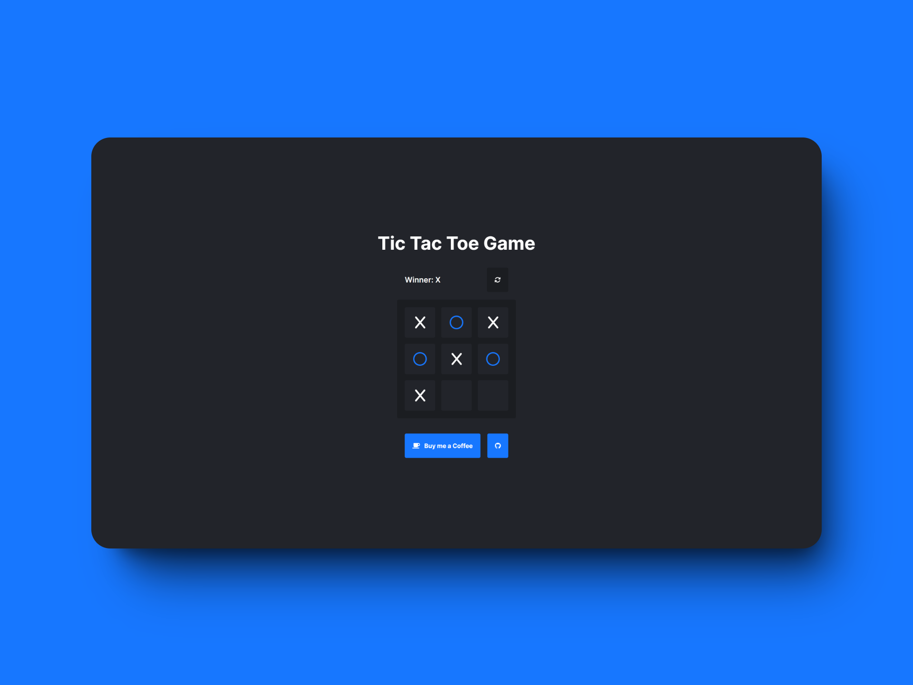

# 🖋️ TicTacToe-NextJs
This repository contains a modern implementation of the classic Tic Tac Toe game, built using Next.js. The game features a sleek, responsive design and provides an engaging user experience. It serves as a great example of how to leverage the power of Next.js for building interactive, client-side applications.

## 💻 Getting Started

First, run the development server:

```bash
npm run dev
# or
yarn dev
# or
pnpm dev
```

Open [http://localhost:3000](http://localhost:3000) with your browser to see the result.

## 📷 Preview

## 🤝 Support

<div align="center">

  [](https://ko-fi.com/SantiiDiazSanchez)
  [](https://buymeacoffee.com/santidiazsanchez)

</div>

## 📄 Additional Information

<div align="center">

If you find this project useful, please consider giving it a ⭐️ on GitHub and sharing it.

**Last edited:** June 26, 2024

© 2024 Santi Díaz

</div>